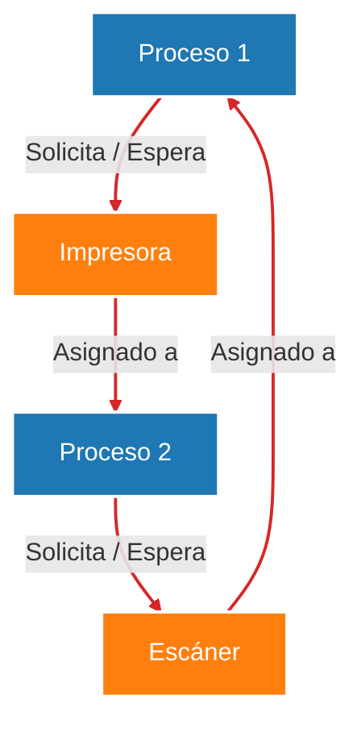
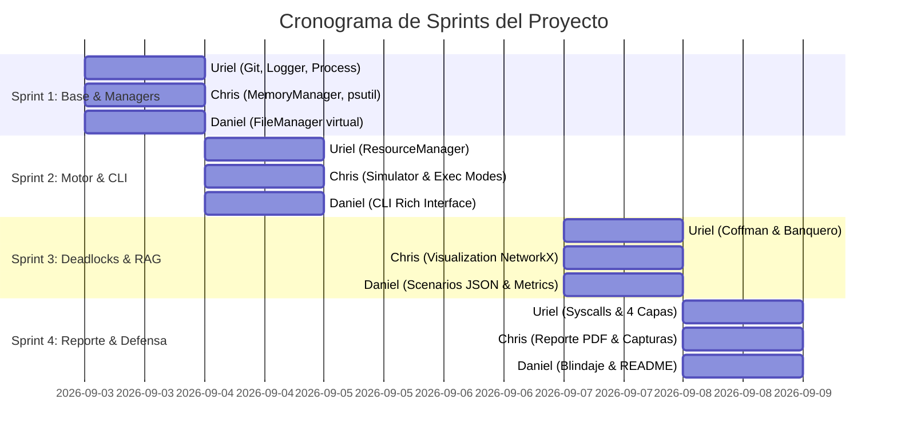

# Plan Maestro de Sprints y Guía de Trabajo en Equipo

> **Proyecto:** Simulador de Administración de Recursos e Interbloqueos (Sistemas Operativos)  
> **Integrantes:** Uriel (Líder / Revisor de PR), Chris, Daniel  
> **Fechas de trabajo:** 3 al 8 de Septiembre de 2026 *(4 días hábiles: Jueves 3, Viernes 4, Lunes 7 y Martes 8)*

---

## 1. Contexto y Propósito del Proyecto

El objetivo principal es programar en **Python** un **simulador de un micro Sistema Operativo**.

En un sistema operativo real, el núcleo actúa como un árbitro en un entorno multitarea: varios procesos compiten por memoria RAM física, operaciones de E/S en archivos virtuales y dispositivos exclusivos (ej. impresoras, escáneres). Si el sistema no gestiona coordinadamente estas asignaciones, los procesos pueden entrar en un **interbloqueo (deadlock)**, quedando congelados indefinidamente.



### Funcionalidades Clave del Simulador
1. **Simular el reparto:** Asignar memoria RAM, prestar dispositivos y controlar operaciones de archivos virtuales.
2. **Detección automática:** Identificar congelamientos comprobando las **4 Condiciones de Coffman** mediante algoritmos en grafos dirigidos.
3. **Visualización gráfica:** Desplegar una ventana con el **Grafo de Asignación de Recursos (RAG)** resaltando los ciclos críticos en rojo.
4. **Evasión inteligente:** Implementar el **Algoritmo del Banquero** para detener peticiones riesgosas antes de caer en estados inseguros.

---

## 2. Decisiones Técnicas Acordadas

| Área | Decisión Adoptada | Razón / Detalle |
| :--- | :--- | :--- |
| **Interfaz de Usuario** | **CLI Enriquecida (`rich`) + Pop-up (`matplotlib`)** | Terminal con tablas tabulares, barras de RAM y recuadros de colores. Ventana emergente con `networkx` para el Grafo de Asignación de Recursos. |
| **Manejo de Interbloqueos** | **Algoritmo del Banquero (Evasión)** | Evalúa si conceder una solicitud mantiene un *Estado Seguro*. En caso contrario, el proceso se encola temporalmente. |
| **Arquitectura de Código** | **Paquete Modular `managers/`** | Separación estricta entre administradores de recursos (`managers/`) y motores de simulación/visualización en la raíz. |
| **Flujo en Git / GitHub** | **Pull Requests (PR) & Code Review** | Trabajo en ramas `feature/nombre-tarea`. Fusión a `main` supervisada por Uriel con aprobación previa de un compañero. |

---

## 3. Estructura Oficial del Repositorio

```text
Proyecto_SO/
│
├── main.py                     # Menú interactivo principal y punto de entrada
├── process.py                  # Ficha técnica del proceso y sus 4 estados
├── deadlock_detector.py        # Condiciones de Coffman y detección de ciclos
├── banker_strategy.py          # Lógica del Algoritmo del Banquero (Evasión)
├── simulator.py                # Motor de ejecución (Modo Automático y Paso a Paso)
├── cli_interface.py            # Vistas bonitas en consola con tablas y paneles (rich)
├── monitoring.py               # Consulta del hardware real con psutil
├── visualization.py            # Ventana emergente con el grafo (NetworkX y Matplotlib)
├── metrics.py                  # Recopilación y tabla final de resultados
│
├── managers/                   # Paquete con los administradores de recursos
│   ├── __init__.py             # Identificador de paquete Python
│   ├── memory_manager.py       # Administrador de la memoria RAM simulada
│   ├── file_manager.py         # Sistema de archivos virtual (CRUD)
│   └── resource_manager.py     # Administrador de recursos exclusivos y compartidos
│
├── scenarios/                  # Escenarios JSON de prueba
│   ├── escenario_1.json        # Ejecución normal sin interbloqueos
│   ├── escenario_2.json        # Espera temporal que se resuelve sola
│   ├── escenario_3.json        # Interbloqueo real provocado
│   ├── escenario_4.json        # Evasión exitosa con Algoritmo del Banquero
│   └── escenario_5.json        # Escenario a gran escala (múltiples procesos)
│
├── logs/
│   └── simulacion.log          # Registro histórico generado automáticamente
│
├── requirements.txt            # Dependencias: rich, networkx, matplotlib, psutil
└── README.md                   # Manual de instalación y uso
```

---

## 4. Estándar de los Archivos de Escenarios (JSON)

Todos los escenarios en la carpeta `scenarios/` deben seguir de forma estricta la estructura especificada a continuación:

```json
{
  "total_memory": 1024,
  "resources": [
    { "name": "Impresora_1", "type": "exclusive" },
    { "name": "Scanner_1", "type": "exclusive" },
    { "name": "Disco_Virtual", "type": "shared", "units": 5 }
  ],
  "processes": [
    {
      "pid": "P1",
      "memory_required": 256,
      "instructions": [
        { "step": 1, "action": "request_resource", "resource": "Impresora_1" },
        { "step": 2, "action": "create_file", "file": "reporte.txt" },
        { "step": 3, "action": "request_resource", "resource": "Scanner_1" },
        { "step": 4, "action": "release_resource", "resource": "Impresora_1" },
        { "step": 5, "action": "release_resource", "resource": "Scanner_1" }
      ]
    }
  ]
}
```

---

## 5. Cronograma Detallado Día por Día



### 🗓️ SPRINT 1: Jueves 3 de Septiembre
> **Meta del día:** Base del proyecto funcional (Modelado de procesos, `MemoryManager`, `FileManager` en `managers/` y registro de logs).

| Integrante | Código / Tarea | Descripción Detallada |
| :--- | :--- | :--- |
| **Uriel** *(Líder)* | `logger.py` <br> `process.py` | • Inicializar repositorio Git, `.gitignore`, `requirements.txt` y paquete `managers/`. <br> • Configurar logger (`logs/simulacion.log` + salida a terminal). <br> • Crear clase `Process` con campos `pid`, `memory_required`, `resources_needed`, `resources_held`, `state` (`ACTIVO_O_LISTO`, `ESPERANDO`, `BLOQUEADO`, `TERMINADO`) y `pending_actions`. |
| **Chris** | `managers/memory_manager.py` <br> `monitoring.py` | • Crear `MemoryManager`: control de `total_memory`, `used_memory`, `available_memory` y `peak_memory_used`. <br> • Métodos `allocate_memory(process)` y `release_memory(process)`. <br> • Crear módulo `monitoring.py` con `psutil` (CPU %, RAM real, Disco, Red). |
| **Daniel** | `managers/file_manager.py` | • Crear `FileManager`: operaciones `create_file`, `read_file`, `write_file`, `move_file`, `delete_file`. <br> • Control de concurrencia para evitar condiciones de carrera o escrituras simultáneas sobre archivos en uso. |

---

### 🗓️ SPRINT 2: Viernes 4 de Septiembre
> **Meta del día:** Conexión de gestores con el motor de simulación e interfaz interactiva en consola (modos automático y paso a paso).

| Integrante | Código / Tarea | Descripción Detallada |
| :--- | :--- | :--- |
| **Uriel** *(Líder)* | `managers/resource_manager.py` | • Administrador de Recursos exclusivos (uso uniproceso) y compartidos (múltiples unidades). <br> • Métodos `request_resource` y `release_resource` con encolamiento de procesos. <br> • Revisión y Merge de PRs a la rama `main`. |
| **Chris** | `simulator.py` | • Cargar y validar escenarios JSON (`total_memory`, `resources`, `processes`). <br> • Implementar **Modo Automático** (lote completo) y **Modo Paso a Paso** (`step()` con pausas e inspección). |
| **Daniel** | `cli_interface.py` | • Interfaz visual de terminal con la librería `rich`. <br> • Renderizado de tabla de procesos coloreada por estado, barra de memoria RAM, tabla de asignación de recursos y panel de hardware real (`psutil`). |

---

### 🗓️ SPRINT 3: Lunes 7 de Septiembre
> **Meta del día:** Detección de interbloqueos, Algoritmo del Banquero, renderizado de RAG con Matplotlib/NetworkX y creación de escenarios.

| Integrante | Código / Tarea | Descripción Detallada |
| :--- | :--- | :--- |
| **Uriel** *(Líder)* | `deadlock_detector.py` <br> `banker_strategy.py` | • Evaluación programática de las 4 **Condiciones de Coffman**. <br> • Algoritmo de detección de ciclos dirigidos en el grafo RAG. <br> • Algoritmo del Banquero (`banker_strategy.py`) para comprobación de *Estado Seguro* y evasión de deadlocks. |
| **Chris** | `visualization.py` | • Grafo RAG con `networkx` y `matplotlib`: nodos de procesos (círculos azules), nodos de recursos (cuadrados anaranjados), aristas de solicitud y asignación. <br> • Coloreado automático en **rojo** para los ciclos de interbloqueo detectados. |
| **Daniel** | `scenarios/*.json` <br> `metrics.py` | • Construir los 5 archivos JSON requeridos (`escenario_1.json` al `escenario_5.json`). <br> • Generar tabla final con métricas del sistema: total de procesos, terminados, bloqueados, solicitudes atendidas, pico de RAM e interbloqueos resueltos. |

---

### 🗓️ SPRINT 4: Martes 8 de Septiembre
> **Meta del día:** Reporte técnico en PDF, pruebas de resistencia contra escenario sorpresa y simulacro de defensa oral.

| Integrante | Código / Tarea | Descripción Detallada |
| :--- | :--- | :--- |
| **Uriel** *(Líder)* | Documentación / Syscalls | • Diseñar el diagrama de 4 capas: *Aplicación $\to$ Shell/CLI $\to$ Kernel $\to$ Hardware*. <br> • Redactar la justificación técnica de 5 llamadas al sistema reales (`sys_brk`/`mmap`, `creat`/`open`, `read`/`write`, `unlink`, `sem_wait`/`mutex`). |
| **Chris** | Reporte Técnico PDF | • Redactar introducción, objetivos, justificación de arquitectura modular (`managers/`), análisis de Coffman y teoría del Banquero. <br> • Incluir capturas de la CLI (`rich`), grafos (`networkx`) y tablas de métricas. |
| **Daniel** | Pruebas & `README.md` | • Pruebas de estrés y blindaje contra datos irregulares (*Escenario Sorpresa* sin identificadores fijos). <br> • Redacción del `README.md` con guía de instalación (`pip install -r requirements.txt`) y ejecución. |

---

## 6. Blindaje y Defensa Oral

> [!IMPORTANT]
> **Defensa del Escenario Sorpresa:** La docente cargará un archivo JSON no revelado previamente. El código **NO DEBE** asumir identificadores fijos como `"P1"`, `"P2"` o `"Impresora_1"`. Todo el comportamiento debe ser **completamente dinámico**.

> [!TIP]
> **Simulacro de Defensa (Martes 8 por la tarde):** Se realizará una sesión de ensayo de 30 minutos donde los tres integrantes alternarán la explicación del código, ejecución de escenarios y respuesta a preguntas teóricas sobre sistemas operativos.