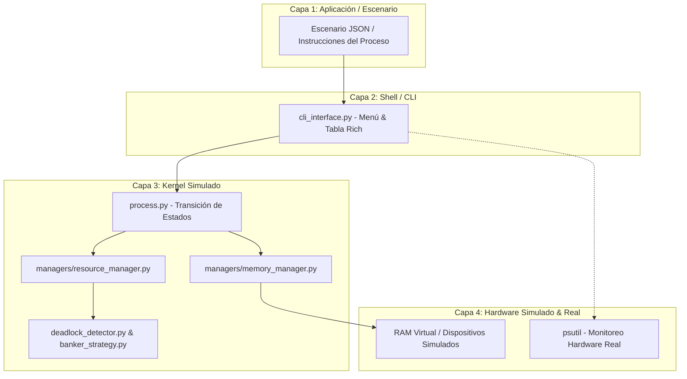
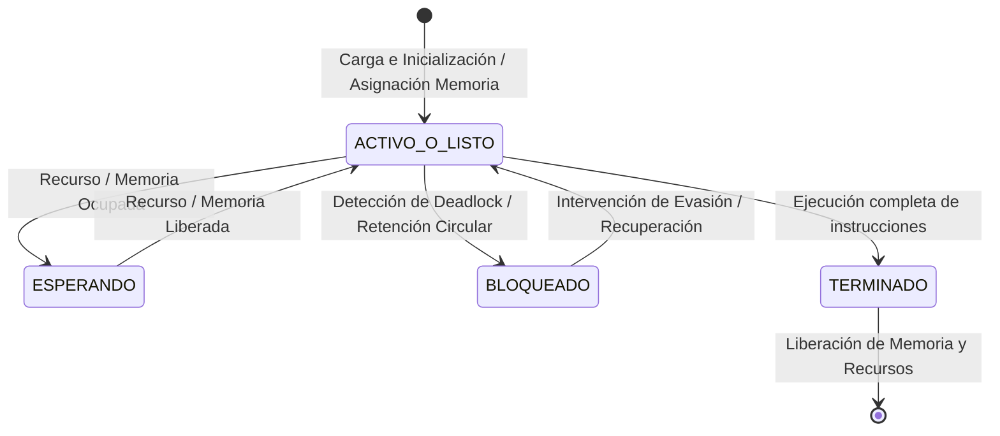

# Resumen Técnico e Integral del Proyecto

> **Asignatura:** Sistemas Operativos  
> **Proyecto:** Simulador de Administración de Recursos e Interbloqueos (Micro-Kernel)  
> **Documento:** Guía Técnica Integral, Arquitectura de Software y Decisiones de Equipo

---

## 1. Resumen Ejecutivo y Propósito Real del Proyecto

El objetivo del proyecto consiste en desarrollar en **Python** un **simulador discreto del núcleo de un Sistema Operativo**. El sistema no administra la computadora real del usuario, sino que actúa como un entorno virtualizado en el cual múltiples procesos artificiales compiten por recursos finitos (memoria RAM, dispositivos exclusivos, periféricos compartidos y archivos virtuales).

El núcleo del proyecto y su principal peso evaluativo (**más del 70% de la calificación**) radica en la gestión de la contención de recursos y el tratamiento formal de interbloqueos (*deadlocks*). El simulador debe ser capaz de modelar el ciclo de vida de los procesos, detectar estados de inanición o bloqueo mutuo mediante teoría de grafos, verificar algorítmicamente las **4 Condiciones de Coffman**, generar un grafo visual explicativo (RAG) y ejecutar una estrategia automatizada de prevención o recuperación.



---

## 2. Módulos y Arquitectura del Sistema

### 2.1 Modelado de Procesos y Ciclo de Vida (`process.py`)

Cada entidad de proceso dentro del simulador se representa mediante una clase orientada a objetos que encapsula de forma estricta los siguientes atributos obligatorios:

* **PID (Identificador Único):** Nombre o valor alfanumérico irrepetible (ej. `"P1"`, `"Proceso_Web"`).
* **Memoria Requerida:** Cantidad de memoria RAM simulada indispensable para existir.
* **Recursos Necesarios:** Conjunto global de recursos requeridos a lo largo de su ejecución.
* **Recursos Poseídos:** Lista dinámica de recursos retenidos por el proceso en el instante actual.
* **Acciones Pendientes:** Cola ordenada de operaciones que el proceso tiene programado solicitar.
* **Estado Actual:** Transición formal entre los 4 estados principales.



---

### 2.2 Administrador de Memoria (`managers/memory_manager.py`)

El simulador impone una restricción de memoria global configurable:
1. **Configuración Dinámica:** El límite total de memoria se lee desde el archivo JSON de escenario (`total_memory`).
2. **Validación de Suficiencia:** Evalúa si $\text{memoria\_solicitada} \le \text{memoria\_disponible}$. Si no alcanza, el proceso pasa al estado `ESPERANDO`.
3. **Liberación Determinista:** Al finalizar o cancelarse un proceso, su memoria se reintegra al pozo común.
4. **Telemetría y Registro Histórico:** Muestra en tiempo real Memoria Total, Utilizada y Disponible, manteniendo el registro del **pico máximo de memoria consumida**.

---

### 2.3 Administrador de Archivos Virtuales (`managers/file_manager.py`)

Modela el subsistema de archivos virtuales del sistema operativo:
* **Operaciones CRUD Soportadas:** Crear (`create`), Leer (`read`), Escribir (`write`), Mover/Renombrar (`move`) y Eliminar (`delete`).
* **Control de Concurrencia:** Mantiene una tabla de archivos en uso. Rechaza o encola operaciones si un proceso intenta modificar o borrar un archivo abierto por otro.
* **Manejo de Excepciones:** Genera errores controlados y los registra en el log sin detener la ejecución del simulador.

---

### 2.4 Administrador de Recursos y Dispositivos (`managers/resource_manager.py`)

Supervisa el inventario de recursos simulados divididos en dos categorías:
* **Recursos Exclusivos:** Solo un proceso puede retenerlos a la vez (ej. `Impresora_1`, `Scanner_1`). Aplican exclusión mutua estricta.
* **Recursos Compartidos:** Poseen múltiples unidades disponibles (ej. `Disco_Virtual` con 5 unidades).
* **Tabla de Asignación:** Mapea la retención actual (`Recurso` $\to$ `PID`) y las colas de espera (`Recurso` $\to$ `[PID_esperando]`).

---

### 2.5 Módulo de Interbloqueos y Teoría de Grafos (`deadlock_detector.py` y `visualization.py`)

Es el componente analítico de mayor ponderación:

#### 1. Verificación de las 4 Condiciones de Coffman
* **Exclusión Mutua:** Recursos de uso exclusivo retenidos por un solo proceso.
* **Retención y Espera (Hold and Wait):** Procesos que retienen recursos mientras solicitan adicionales.
* **No Expropiación (No Preemption):** Los recursos no se quitan a la fuerza; sólo se liberan voluntariamente.
* **Espera Circular:** Existe una cadena cerrada de procesos aguardando recursos entre sí.

#### 2. Detección de Ciclos en Grafo RAG
Construcción de un **Grafo de Asignación de Recursos (RAG)** dirigido bipartito. Se aplican algoritmos de búsqueda de ciclos dirigidos para identificar con exactitud los PIDs y recursos atascados.

#### 3. Visualización con NetworkX y Matplotlib
Renderizado interactivo donde:
* **Procesos:** Nodos circulares azules.
* **Recursos:** Nodos cuadrados anaranjados.
* **Asignación ($\text{Recurso} \to \text{Proceso}$):** Aristas continuas.
* **Solicitud ($\text{Proceso} \to \text{Recurso}$):** Aristas punteadas/dirigidas.
* **Ciclo de Deadlock:** Resaltado automático en **color rojo**.

---

### 2.6 Auditoría y Monitoreo Real (`monitoring.py` y Logger)

* **Archivo de Logs (`logs/simulacion.log`):** Registro cronológico detallado con marcas de tiempo para cada evento (asignaciones, bloqueos, resoluciones).
* **Monitoreo con `psutil`:** Lee el uso de CPU %, RAM física real, espacio en disco y red del equipo anfitrión para contrastar la telemetría real contra el micro-núcleo simulado.

---

## 3. Modos de Ejecución y Métricas Obligatorias

El motor (`simulator.py`) soporta dos modalidades de interacción:
* **Modo Automático:** Procesa el lote completo hasta agotar instrucciones o resolver bloqueos, desplegando el cuadro final de métricas.
* **Modo Paso a Paso:** Avanza instrucción por instrucción (`tick`), permitiendo inspeccionar estados, memoria y recursos en cada instante.

### 📊 Tabla de Métricas de Salida Obligatorias

| Métrica | Descripción | Criterio de Validación |
| :--- | :--- | :--- |
| **Total de procesos simulados** | Conteo global de procesos presentes en el escenario | Debe coincidir con la lista original del JSON |
| **Procesos terminados exitosamente** | Procesos que completaron sus instrucciones y liberaron recursos | Deben retornar su memoria al pozo común |
| **Procesos bloqueados residuales** | Procesos que no pudieron concluir por contención crítica | Deben estar identificados en el grafo RAG |
| **Pico máximo de memoria consumida** | Valor histórico máximo de memoria RAM utilizada | Se actualiza en `MemoryManager` ante cada asignación |
| **Total de solicitudes de recursos** | Número acumulado de operaciones `request_resource` | Registrado cronológicamente en el logger |
| **Frecuencia de espera de procesos** | Conteo total de transiciones hacia el estado `ESPERANDO` | Refleja el grado de contención del escenario |
| **Interbloqueos detectados vs. resueltos** | Cantidad de ciclos hallados vs. desatados por la estrategia | Valida la eficacia del Algoritmo del Banquero |
| **Recursos involucrados en deadlocks** | Lista explícita de identificadores de recursos en ciclo | Coincide con las aristas rojas del grafo |
| **Balance de liberación final** | Auditoría de recursos devueltos al cerrar la simulación | Verifica que no existan fugas de recursos simulados |

---

## 4. Escenarios de Prueba y Escenario Sorpresa

| Escenario | Comportamiento Provocado | Objetivo de Evaluación |
| :--- | :--- | :--- |
| **Escenario 1** | Ejecución normal sin contención crítica | Verificar la asignación fluida y terminación exitosa de todos los procesos. |
| **Escenario 2** | Espera temporal sin interbloqueo | Probar que un proceso espera a que otro libere un recurso sin marcar falso deadlock. |
| **Escenario 3** | Interbloqueo puro (Deadlock provocado) | Demostrar la detección de las 4 condiciones de Coffman y resaltado rojo en el grafo RAG. |
| **Escenario 4** | Evasión activa con Algoritmo del Banquero | Probar la denegación temporal de peticiones inseguras para evitar el congelamiento. |
| **Escenario 5** | Escenario complejo a gran escala | Evaluar la escalabilidad y robustez con $\ge 6$ procesos y múltiples recursos simultáneos. |

> [!CAUTION]
> **¡ADVERTENCIA CRÍTICA - ESCENARIO SORPRESA!**  
> Durante la evaluación individual, la docente utilizará un archivo JSON con identificadores no vistos previamente. La lógica del sistema debe ser **100% dinámica** y no depender de nombres fijos como `"P1"`, `"P2"` o `"Impresora_1"`.

---

## 5. Marco Teórico Exigido (Syscalls y Capas de SO)

### 5.1 Mapeo de 5 Llamadas al Sistema (Syscalls)

| Operación Simulada | Llamada al Sistema POSIX / Linux Real | Justificación Técnica |
| :--- | :--- | :--- |
| **Solicitud de Memoria** | `brk()` / `mmap()` | Ajusta el límite del segmento de datos o mapea páginas de memoria anónima en el espacio de direcciones. |
| **Creación de Archivo** | `creat()` / `open(..., O_CREAT)` | Reserva un inodo en el sistema de archivos y devuelve un descriptor de archivo (*file descriptor*). |
| **Lectura / Escritura de Archivo** | `read()` / `write()` | Transfiere bloques de datos entre el búfer del espacio de usuario y el caché de páginas del Kernel. |
| **Eliminación de Archivo** | `unlink()` | Decrementa el contador de enlaces del inodo y libera los bloques de disco cuando llega a cero. |
| **Petición de Recurso Exclusivo** | `sem_wait()` / `pthread_mutex_lock()` | Primitiva de sincronización que bloquea el hilo/proceso en una cola de espera si el recurso está tomado. |

---

### 5.2 Transición a través de las 4 Capas del Sistema Operativo

```text
┌────────────────────────────────────────────────────────────────────────┐
│ 1. CAPA APLICACIÓN: El proceso emite la instrucción del escenario JSON │
└──────────────────────────────────┬─────────────────────────────────────┘
                                   │
                                   ▼
┌────────────────────────────────────────────────────────────────────────┐
│ 2. CAPA SHELL / INTERFAZ: cli_interface.py interpreta el comando       │
└──────────────────────────────────┬─────────────────────────────────────┘
                                   │
                                   ▼
┌────────────────────────────────────────────────────────────────────────┐
│ 3. CAPA KERNEL: MemoryManager / ResourceManager / Banker Strategy       │
│    Valida permisos, evalúa Estado Seguro y actualiza estructuras      │
└──────────────────────────────────┬─────────────────────────────────────┘
                                   │
                                   ▼
┌────────────────────────────────────────────────────────────────────────┐
│ 4. CAPA HARDWARE: RAM Virtual simulada / Controladores de E/S          │
└────────────────────────────────────────────────────────────────────────┘
```

---

## 6. Ponderación Oficial de Evaluación (Rúbrica 100%)

| Criterio Evaluado | Valor | Aspecto Central |
| :--- | :---: | :--- |
| **Detección de interbloqueos** | **20%** | Detección automática generalizable mediante búsqueda de ciclos en grafos dirigidos. |
| **Administración de recursos** | **15%** | Solicitud, retención, espera y liberación de recursos exclusivos y compartidos. |
| **Modelado de procesos y estados** | **10%** | Representación rigurosa de los 4 estados y ciclo de vida de procesos. |
| **Administración de memoria** | **10%** | Configuración de límite global, asignación dinámica, liberación y pico histórico. |
| **Administración de archivos y dispositivos** | **10%** | Operaciones CRUD simuladas integradas al flujo de ejecución con control de concurrencia. |
| **Análisis de las 4 condiciones** | **10%** | Verificación programática explícita de las condiciones de Coffman. |
| **Prevención o recuperación** | **10%** | Estrategia funcional del Algoritmo del Banquero para evitar o deshacer deadlocks. |
| **Visualización y logs** | **5%** | Grafos claros en NetworkX/Matplotlib y archivo de log persistente (`simulacion.log`). |
| **Diseño del software** | **5%** | Modularidad limpia (`managers/`), manejo de excepciones y legibilidad del código. |
| **Defensa del proyecto** | **5%** | Demostración fluida en vivo y dominio individual de los temas teóricos. |

---

## 7. Acuerdos y Decisiones Técnicas del Equipo

1. **Interfaz de Usuario:** CLI Enriquecida mediante `rich` con paneles y tablas en consola. Ventanas pop-up con `matplotlib` + `networkx` para el despliegue del grafo RAG.
2. **Estrategia de Interbloqueos:** Implementación del **Algoritmo del Banquero** (Evasión dinámica de estados inseguros) como mecanismo principal.
3. **Formato JSON:** Estándar desacoplado con llaves `total_memory`, `resources` y `processes`.
4. **Grafos Integrados:** Uso de `networkx.DiGraph` para análisis de ciclos dirigidos (`simple_cycles`) y renderizado cromático con `matplotlib`.